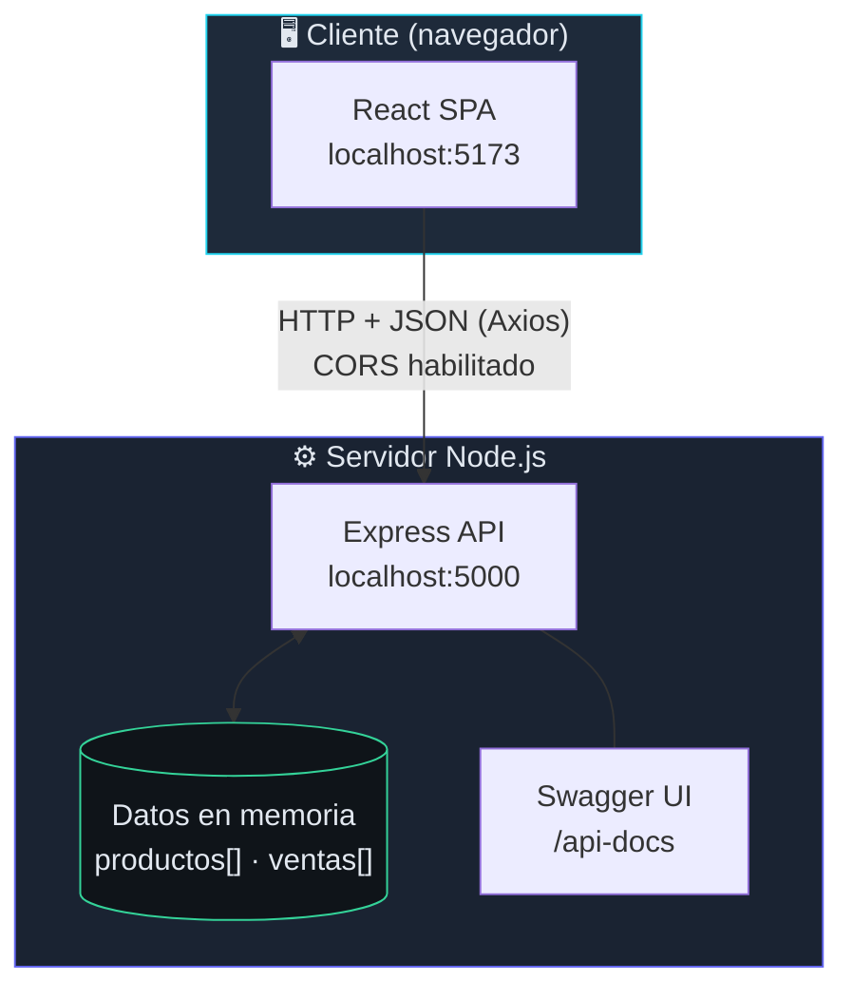
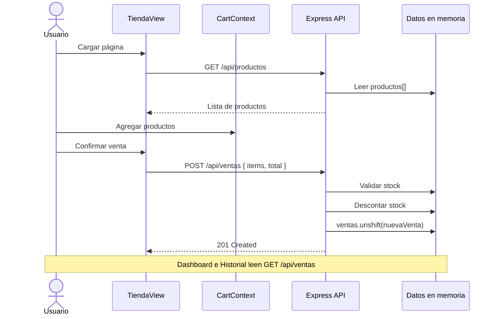
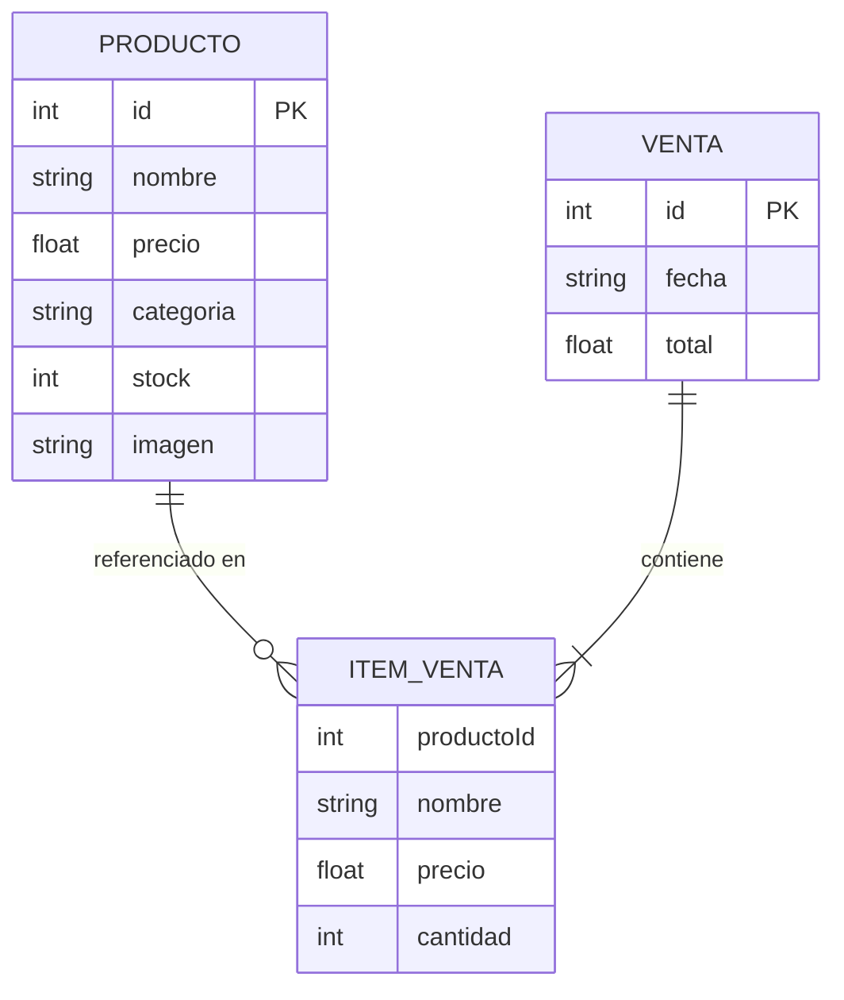

# Sistema POS — Punto de Venta

Aplicación web full-stack para gestionar ventas en mostrador: catálogo de productos, carrito de compras, registro de transacciones, historial y panel analítico con gráficos en tiempo real (datos en memoria).

**Repositorio:** [github.com/karenBjorn/Sistema-POS](https://github.com/karenBjorn/Sistema-POS)

---

## Tabla de contenido

- [Descripción general](#descripción-general)
- [Características](#características)
- [Arquitectura del sistema](#arquitectura-del-sistema)
- [Flujo de una venta](#flujo-de-una-venta)
- [Stack tecnológico](#stack-tecnológico)
- [Estructura del proyecto](#estructura-del-proyecto)
- [API REST](#api-rest)
- [Interfaz de usuario](#interfaz-de-usuario)
- [Requisitos e instalación](#requisitos-e-instalación)
- [Ejecución local](#ejecución-local)
- [Almacenamiento de datos](#almacenamiento-de-datos)
- [Consideraciones](#consideraciones)

---

## Descripción general

El proyecto está organizado como **monorepo de dos capas físicas** en la raíz del repositorio:

| Capa | Carpeta | Rol |
|------|---------|-----|
| **Backend** | `/backend` | API REST con Express. Expone productos y ventas; valida stock y persiste transacciones en arreglos en memoria. |
| **Frontend** | `/frontend` | SPA en React que consume la API, gestiona el carrito con Context API y presenta la UI con Tailwind CSS. |

No hay base de datos externa: el inventario y el historial viven en memoria del servidor Node.js, lo que permite ejecutar y probar el sistema de inmediato en local.

---

## Características

| Módulo | Descripción |
|--------|-------------|
| **Tienda (POS)** | Catálogo con filtros por categoría, tarjetas de producto y carrito lateral con cantidades. |
| **Checkout** | Confirmación de venta vía `POST /api/ventas`; descuento automático de stock. |
| **Historial** | Listado detallado de todas las transacciones registradas. |
| **Dashboard** | KPIs (ingresos, ticket promedio, unidades) y gráficos con Recharts. |
| **Documentación API** | Swagger UI en `/api-docs`. |

---

## Arquitectura del sistema

### Vista general (cliente–servidor)



### Capas del frontend

```mermaid
flowchart LR
    subgraph Vistas["Views (páginas)"]
        V1["TiendaView"]
        V2["DashboardView"]
        V3["HistorialView"]
    end

    subgraph Componentes["Components"]
        C1["TarjetaProducto · CarritoVentas"]
        C2["Charts · StatCard"]
        C3["HistorialVentas"]
    end

    subgraph Estado["Estado global"]
        CTX["CartContext<br/>useReducer"]
    end

    subgraph Servicios["Capa de datos"]
        API_CLIENT["api/client.js<br/>Axios"]
    end

    V1 --> C1
    V1 --> CTX
    V2 --> C2
    V3 --> C3
    V1 & V2 & V3 --> API_CLIENT
    CTX --> C1

    API_CLIENT -->|REST| BACKEND["Backend Express"]

    style Vistas fill:#1e2a3a,stroke:#22d3ee
    style Componentes fill:#1e2a3a,stroke:#818cf8
    style Estado fill:#1e2a3a,stroke:#fbbf24
    style Servicios fill:#1e2a3a,stroke:#34d399
```



### Capas del backend

```mermaid
flowchart TB
    REQ["Petición HTTP"] --> CORS["CORS + JSON parser"]
    CORS --> ROUTES["Rutas REST<br/>/api/productos · /api/ventas"]
    ROUTES --> LOGIC["Lógica de negocio<br/>validación · stock · totales"]
    LOGIC --> DATA[("Arrays en memoria")]
    ROUTES --> DOCS["swagger-ui-express<br/>/api-docs"]

    style REQ fill:#334155,stroke:#94a3b8
    style DATA fill:#0f1419,stroke:#34d399
```



---

## Flujo de una venta



---

## Stack tecnológico

### Backend (`/backend`)

| Tecnología | Uso |
|------------|-----|
| **Node.js** | Runtime del servidor |
| **Express 4** | Enrutamiento y middleware HTTP |
| **CORS** | Permite peticiones desde el frontend (puerto 5173) |
| **swagger-jsdoc** + **swagger-ui-express** | Documentación OpenAPI interactiva |

### Frontend (`/frontend`)

| Tecnología | Uso |
|------------|-----|
| **React 18** | Interfaz de usuario por componentes |
| **Vite 6** | Bundler y servidor de desarrollo |
| **React Router 6** | Navegación entre vistas |
| **Axios** | Cliente HTTP hacia la API |
| **Tailwind CSS 3** | Estilos utility-first (tema dashboard oscuro) |
| **Recharts 2** | Gráficos del panel analítico |
| **Context API + useReducer** | Estado global del carrito |

---

## Estructura del proyecto

```
Sistema-POS/
│
├── backend/                      # Capa API
│   ├── server.js                 # Servidor Express, rutas y datos en memoria
│   ├── package.json
│   └── package-lock.json
│
├── frontend/                     # Capa cliente
│   ├── index.html
│   ├── vite.config.js
│   ├── tailwind.config.js
│   ├── postcss.config.js
│   └── src/
│       ├── main.jsx              # Punto de entrada React
│       ├── App.jsx               # Rutas principales
│       ├── index.css             # Estilos globales + Tailwind
│       ├── api/
│       │   └── client.js         # Instancia Axios y funciones API
│       ├── context/
│       │   └── CartContext.jsx   # Carrito (add, update, clear, total)
│       ├── utils/
│       │   ├── format.js         # Formato moneda y fechas
│       │   └── ventasStats.js    # Métricas para el dashboard
│       ├── views/
│       │   ├── TiendaView.jsx    # POS / catálogo
│       │   ├── DashboardView.jsx # Panel y gráficos
│       │   └── HistorialView.jsx # Listado de ventas
│       └── components/
│           ├── Layout.jsx        # Cabecera y navegación
│           ├── TarjetaProducto.jsx
│           ├── CarritoVentas.jsx
│           ├── HistorialVentas.jsx
│           └── dashboard/        # StatCard, gráficos Recharts, tabla
│
├── .gitignore
└── README.md
```

---

## API REST

Base URL local: `http://localhost:5000`

Documentación interactiva: **[http://localhost:5000/api-docs](http://localhost:5000/api-docs)**

| Método | Endpoint | Descripción | Respuesta |
|--------|----------|-------------|-----------|
| `GET` | `/api/productos` | Inventario completo | `200` — array de productos |
| `GET` | `/api/ventas` | Historial de ventas (más recientes primero) | `200` — array de ventas |
| `POST` | `/api/ventas` | Registra una venta y actualiza stock | `201` — venta creada · `400` — error de validación |

### Ejemplo — registrar venta

**Request**

```http
POST /api/ventas
Content-Type: application/json
```

```json
{
  "items": [
    {
      "productoId": 1,
      "nombre": "Café Americano",
      "precio": 3.5,
      "cantidad": 2
    }
  ],
  "total": 7.0
}
```

**Response** `201 Created`

```json
{
  "id": 1,
  "fecha": "2026-05-24T20:00:00.000Z",
  "items": [ ... ],
  "total": 7.0
}
```

---

## Interfaz de usuario

| Ruta | Vista | Función |
|------|-------|---------|
| `/` | Tienda | Catálogo, carrito y confirmación de venta |
| `/dashboard` | Dashboard | KPIs, gráficos de ingresos/ventas y top productos |
| `/historial` | Historial | Detalle de cada transacción |

**URLs locales (con servidores en ejecución)**

| Recurso | URL |
|---------|-----|
| Aplicación | http://localhost:5173 |
| Dashboard | http://localhost:5173/dashboard |
| API | http://localhost:5000 |
| Swagger | http://localhost:5000/api-docs |

---

## Requisitos e instalación

### Requisitos previos

- [Node.js](https://nodejs.org/) **18+**
- [npm](https://www.npmjs.com/) (incluido con Node)

### Instalación de dependencias

Desde la raíz del repositorio, instala cada capa por separado:

```bash
# Backend
cd backend
npm install

# Frontend
cd ../frontend
npm install
```

---

## Ejecución local

> **Importante:** inicia siempre el **backend antes** que el frontend para que el catálogo y el dashboard carguen datos correctamente.

Abre **dos terminales**:

**Terminal 1 — API (puerto 5000)**

```bash
cd backend
npm start
```

Modo desarrollo con recarga automática:

```bash
npm run dev
```

**Terminal 2 — SPA (puerto 5173)**

```bash
cd frontend
npm run dev
```

### Build de producción (frontend)

```bash
cd frontend
npm run build
npm run preview
```

---

## Almacenamiento de datos



| Colección en memoria | Contenido |
|----------------------|-----------|
| `productos[]` | Catálogo inicial (8 productos de ejemplo) |
| `ventas[]` | Transacciones registradas desde el frontend |

Al **reiniciar el servidor backend**, el inventario vuelve a su estado inicial y el historial de ventas se **reinicia**.

---

## Consideraciones

| Tema | Detalle |
|------|---------|
| **Persistencia** | Diseñado para demostración y desarrollo local. Para producción se recomienda MongoDB, PostgreSQL u otro almacén persistente. |
| **Autenticación** | No implementada; cualquier cliente con acceso a la API puede operar el POS. |
| **CORS** | Abierto para desarrollo (`cors()` sin restricciones estrictas). |
| **Próximos pasos sugeridos** | Auth JWT, base de datos, roles (cajero/admin), exportación PDF de tickets, tests automatizados. |

---

## Licencia

Proyecto académico — **MIT License**.

---

<p align="center">
  <sub>Desarrollado como sistema POS full-stack · Express + React + Vite</sub>
</p>
